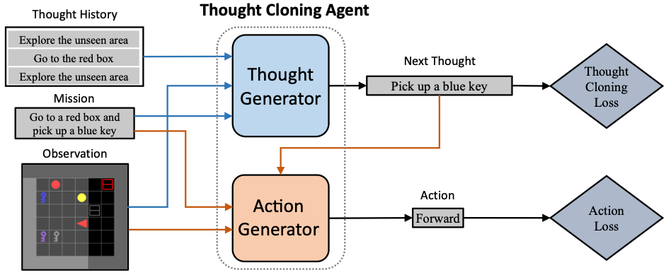

# Thought Cloning: Learning to Think while Acting by Imitating Human Thinking [[arxiv]](https://arxiv.org/abs/2306.00323)

```
@article{hu2023ThoughtCloning,
  title={{Thought Cloning}: Learning to Think while Acting by Imitating Human Thinking},
  author={Shengran Hu and Jeff Clune},
  year={2023},
  journal={arXiv preprint arXiv:2306.00323},
}
```

## Overview
<p align="center">

</p>

This repository provides the official implementation for [Thought Cloning: Learning to Think while Acting by Imitating Human Thinking](https://arxiv.org/abs/2306.00323). Thought Cloning (TC) is a novel imitation learning framework that enhances agent capability, AI Safety, and Interpretability by training agents to *think like humans*. This repository implements TC on a simulated partially observable 2D gridworld domain [BabyAI](https://github.com/mila-iqia/babyai) with a synthetic human thought dataset.

## Installation 
### Creating Environment
Create environment with [python-venv](https://docs.python.org/3.6/library/venv.html) or [conda](https://docs.conda.io/en/latest/). Example with python-venv is shown here:
```
python3 -m venv thoughtcloning
source thoughtcloning/bin/activate 
```

### Key Requirements
- Python >= 3.6
- PyTorch >= 1.7.1
- OpenAI Gym == 0.9.6
- NumPy == 1.19.5
- gym-minigrid == 1.0.0
- blosc  

This repository has been tested with Python 3.9.10 and PyTorch 1.7.1+cu110. **The code may not be compatible with higher version of gym, numpy or gym-minigrid.**

### Installation
1. Install PyTorch 1.7.1+ following [PyTorch official tutorial](https://pytorch.org/get-started/locally/). 
2. Clone this repository and install the other dependencies with pip3
```
git clone https://github.com/ShengranHu/Thought-Cloning.git
cd Thought-Cloning
pip3 install --upgrade pip
pip3 install --editable .
```
**Note: run `pip3 install --editable .` again if the project directory is changed afterward.**

### Configuring Path

Change the output directory in `storage_dir` in [/babyai/utils/\_\_init\_\_.py](https://github.com/ShengranHu/Thought-Cloning/blob/main/babyai/utils/__init__.py). Set `path-to-thought-cloning`to the path of your Thought Cloning project.

## Reproduce the results in the paper

The synthetic human thought dataset on *BossLevel*, trained TC model weights, and collected environments to test out-of-distribution performance are available in [Google Drive](https://drive.google.com/drive/folders/1CMgQtl7GTr0hR7wy3nXDhjdh_wi5gd5T?usp=sharing).

### Reproduce Synthetic Thought Dataset

To reproduce a synthetic thought dataset, you can use the `scripts/make_agent_demos.py` script with the following command:

```
scripts/make_agent_demos.py --episodes <NUM_OF_EPISODES> --env <ENV_NAME> --noise-rate 0.01
```


### Thought Cloning Training

To reproduce the main performance results presented in Fig. 3 of our paper, use the following command:

```
scripts/train_tc.py --env BabyAI-BossLevel-v0 --demos <DEMO_NAME> --memory-dim=2048 --recurrence=80 --batch-size=180 --instr-arch=attgru --instr-dim=256 --val-interval 2 --log-interval 2 --lr 5e-4 --epochs 160 --epoch-length 51200 --seed 0 --val-seed 2023 --model <NAME_OF_MODEL> --sg-coef 2 --warm-start --stop-tf 10
```

For each experiment, you can change the `group_name` argument to group log and model output into a specific folder.

### Zero-shot Evaluation on Out-of-Distribution Environments

To reproduce the zero-shot evaluation results presented in Fig. 4(a) of our paper, use the following command:

```
scripts/evaluate_levels.py --env BabyAI-BossLevel-v0 --model <NAME_OF_MODEL> --testing-levels-path <PATH_TO_TESTING_LEVELS_PICKLE>
```


## Related links
Our implementation is based on [BabyAI 1.1](https://github.com/mila-iqia/babyai) (domain and Imitation Learning baseline), [dan-visdial](https://github.com/gicheonkang/dan-visdial/tree/master/encoders) (Upper-level Component Transformer encoder), and [visdial-rl](https://github.com/batra-mlp-lab/visdial-rl/blob/master/visdial/models/decoders/gen.py) (Upper-level Component RNN decoder).
